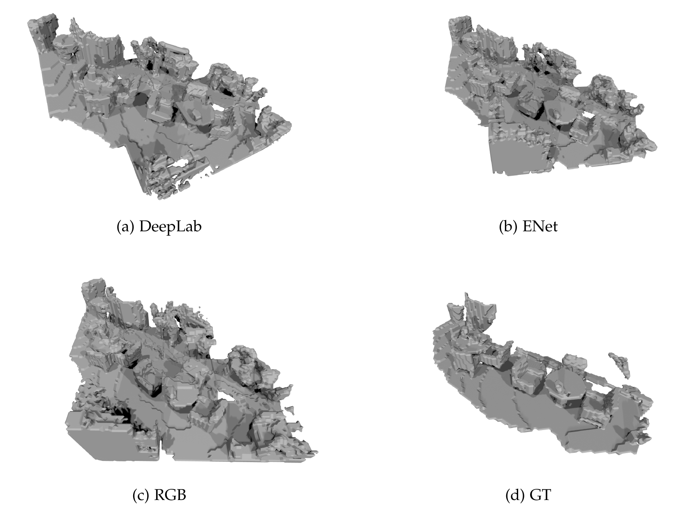
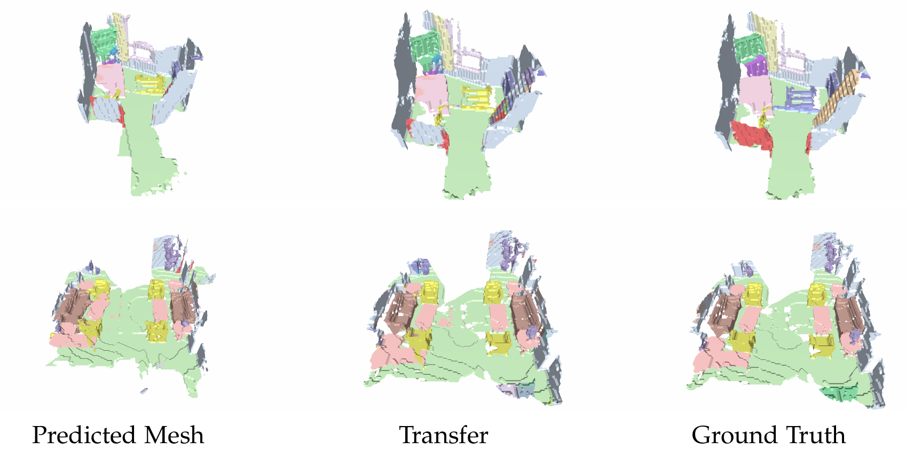

# From reconstruction to segmentation: Using pretrained features from 3D reconstruction in semantic segmentation
Semantic scene segmentation and reconstruction is two of the most important tasks
in computer vision. Although their tasks are different, they share many things in
common. For example, knowing the occluded objects behind the table is a chair helps
us imagine where and what shape the chair leg is, although it is not visible. As a
result, many works have been dedicated to combine two tasks at once, with the goal
of improving both of them by training them jointly. Such task is called semantic 3D
reconstruction. The joint training has proved effective, but it is difficult to know how
and how much one task influence the other. In this work, we try to separate two tasks
and analyze the relationship between them throuh two main experiments. We first
train a 2D segmentation network, then use it as a feature extractor for training on
reconstruction task. We study the effect segmentation model has by training another 3D
network without using the feature extractor. In the second experiment, we finetune the
reconstruction net to scene segmentation task and check if the influence in the opposite
direction also holds.






## Setup
- Create a conda environment from [`environment.yaml`](environment.yml): 
   ```
   conda env create -f environment.yml
   ```
- Install [Open3D](http://www.open3d.org/docs/release/getting_started.html) through pip
## Dataset preparation
Create a folder and download the full scannet dataset to it (e.g path to folder is `SCANNET_RAW`). The structure of dataset inside the folder should be as follows: 
```
   |--scene0000_00/
      |--scene0000_00.sens
      |--label-filt/
         |--[framenum].png
             ⋮
   |--scene0000_01/
      ⋮
   ```
Run the following line of code to extract color, depth frames, camera pose and label images to another folder( e.g path to folder is `SCANNET_2D3D`):
```
python preprocessing_scripts/prepare_2d_data.py --scannet_path SCANNET_RAW --output_path SCANNET_2D3D --export_label_images --frame_skip 10 --label_map_file [path to scannetv2-labels.combined.tsv]
```
The structure of dataset under `SCANNET_2D3D` should now be: 
```
   |--scene0000_00/
      |--color/
         |--[framenum].jpg
             ⋮
      |--depth/
         |--[framenum].png
             ⋮
      |--pose/
         |--[framenum].txt
             ⋮
      |--label/
         |--[framenum].png
             ⋮
   |--scene0000_01/
      ⋮
   ```
### 2D data preparation
We copy RGB of train and val set to a folder (e.g `scannet_250k_images`) and label images to another folder (e.g `labels_250k_images`). An example structure of `scannet_250k_images`: 
```
   |--trainset/
      |--scene0000_00_10.jpg
      |--scene0000_00_20.jpg
             ⋮
      |--scene0000_01_10.jpg
   |--valset/
      ⋮
   ```
### 3D data preparation
Next we voxelize the mesh from ScanNet. There is two options here: 1. to use existing GT mesh from ScanNet (the file `scene%04d_%02d_vh_clean_2.ply`) or 2. generate the GT mesh by ourselves using TSDF fusion. Our work uses the existing GT meshes, but we provide a simple script if you prefer the second way. This step requires an NVIDIA GPU to speed up the process of fusion. We store the generated TSDF meshes in each scene under `SCANNET_2D3D`: 
```
python preprocessing_scripts/tsdf_fusion.py --images_path SCANNET_2D3D --output_path SCANNET_2D3D
   ```
We then proceed with the mesh voxelization. : 
```
python preprocessing_scripts/prepare_occ_grid.py (SCANNET_RAW for option 1 or SCANNET_2D3D for option 2) SCANNET_RAW SCANNET_2D3D --use-tsdf(for option 2)
   ```
Open `experiments/cfgs/backproj_prep.yml` and change `root` to `SCANNET_2D3D`, and also `label_file`, `train_list` and `val_list`. The following code randomly samples subvolumes and store them in `.hdf5` file in folder `data_chunks` under `SCANNET_2D3D`. For training: 
```
python preprocessing_scripts/prep_backproj_data.py experiments/cfgs/backproj_prep.yml train SCANNET_2D3D/data_chunks/train_clean.hdf5 --multiproc --gpu
   ```
For validation we sample non-overlapping subvolumes, so run the line: 
```
python preprocessing_scripts/prep_backproj_data.py experiments/cfgs/backproj_prep.yml val SCANNET_2D3D/data_chunks/val_scenes_non_overlapping_clean.hdf5 --multiproc --gpu --full-scene
   ```
Augmenting the training set by rotating it four times around z axis. We need path to input file and output file here: 
```
python preprocessing_scripts/augment_backproj_data.py SCANNET_2D3D/data_chunks/train_clean.hdf5 SCANNET_2D3D/data_chunks/augmented_train_clean.hdf5
   ```
In the end, we built a data structure inside `SCANNET_2D3D`, which is used for our 3D reconstruction and 3D segmentation: 
```
   |--data_chunks/
      |--train_clean.hdf5
      |--augmented_train_clean.hdf5
      |--val_scenes_non_overlapping_clean.hdf5
   |--scene0000_00/
      |--color/
         |--[framenum].jpg
             ⋮
      |--depth/
         |--[framenum].png
             ⋮
      |--pose/
         |--[framenum].txt
             ⋮
      |--label/
         |--[framenum].png
             ⋮
   |--scene0000_01/
      ⋮
   ```
Inside the repository, create a folder `saved` to store all the checkpoints and tensorboard. It should have the correct structure like this: 
```
   |--thesis_2122/ (our repository)
      |--saved/
         |--models/ (for storing checkpoints)
            |--3d_recon_2dfeat_input/ (3D reconstruction using 2D feature, both ENet and DeepLab)
               |--[checkpoints1]/ 
                  ⋮
               |--[checkpointsn]/
            |--3d_recon_RGB_input/ (3D reconstruction using RGB)
            |--enet (checkpoints for 2D segmentation)
         |--runs/ (for storing tensorboards of corresponding checkponints)
            |--3d_recon_2dfeat_input/ 
               |--[checkpoints1]/
                  ⋮
               |--[checkpointsn]/
            |--3d_recon_RGB_input/
            |--enet
         |--test_results/ (for results during inference)
   ```
## Checkpoints
We provide checkpoints for inference in all of our tasks: please download it [here](https://drive.google.com/drive/folders/1FAaTPPILL89fg4zKAhgrMrK0qfPVRlVI?usp=sharing) and place it accordingly under `saved/models` folder as described above. For example, place folder `3d_recon_deeplab` in the downloaded folder under `3d_recon_2dfeat_input`
## 2D Semantic Segmentation 
### Training
Open `experiments/cfgs/train_enet.json` and change `[train_loader][img_dir]` to `scannet_250k_images/trainset`, `[train_loader][label_dir]` to `label_250k_images/trainset`, change the same with `[val_loader]`. Then run the following: 
```
  python train_enet.py
   ```
### Inference 
Open `experiments/cfgs/test_enet.json`, change `img_dir` and `label_dir` as described above, and fix the path of`load_path` to point it to a `.tar` file checkpoint of deeplab in the checkpoint folder (the folder `deeplab_v3` from download link ). Then run: 
```
  python test_enet.py
   ```
## 3D Scene Reconstruction
### Using RGB input 
Open `experiments/cfgs/rgb_input_3d_recon.json` and point `root` to `SCANNET_2D3D` and run: 
```
  python reconstruction_3d.py --config experiments/cfgs/rgb_input_3d_recon.json
   ```
### Using ENet as 2D feature extractor 
Open `experiments/cfgs/pretrained_feat_input_3d_recon.json`, point `root` to `SCANNET_2D3D` and point `load_path_2d` to `.tar` file in checkpoints folder and run: 
```
  python reconstruction_3d.py --config experiments/cfgs/pretrained_feat_input_3d_recon.json
   ```
### Using DeepLab as 2D feature extractor
Change `pretrained_feat_input_3d_recon.json` as described above and run:
``` 
python reconstruction_3d_2dfeat_deeplabv3.py --config experiments/cfgs/pretrained_feat_input_3d_recon.json
   ```
### Inference
First we need create meshes for gt scenes by assembling all subvolumes of a scene into one volume grid and turn it to mesh. Open `experiments/cfgs/inference_scenes.json`, point `root` to `SCANNET_2D3D`. We save this results in `GT_SCENES`: 
``` 
python inference_scenes.py --output_path GT_SCENES --recon_type gt
   ```
To infer from model using RGB input, apart from above change in `experiments/cfgs/inference_scenes.json`, change `arch_3d` to `surfacenet`, `use_2d_feat_input` to `false`, `depth_shape` to `[328,256]`, point `load_path` to corresponding checkpoints in checkpoints folder. We save this result in `PRED_SCENES`. Notice that we must change `PRED_SCENES` every time we predict a new model. In short, results from each model must be saved in different folder for later evaluation.  Run: 
``` 
python inference_scenes.py --output_path PRED_SCENES --recon_type rgb
   ```
To infer from model using 2D feat input, change `arch_3d` to `surfacenet`, `arch_2d` to `deeplabv3` or `enet`, `use_2d_feat_input` to `true`, `depth_shape` to `[41,32]`, point `load_path_2d` to checkpoints of 2d model and `load_path` to checkpoints of 3d model:
``` 
python inference_scenes.py --output_path PRED_SCENES --recon_type 2dfeat
   ```
### Evaluation
We evalute the predicted mesh in `PRED_SCENES` against the ground truth mesh in `GT_SCENES` by running:
 ``` 
python evaluate.py --scene_list [path to scannetv2_val.txt which includes scene%04d_%02d in each line] --pred_dir PRED_SCENES --gt_dir GT_SCENES --data2d_dir SCANNET_2D3D
   ```

| Model | Acc |Comp3D | Prec | Recal | F-score | AbsRel |AbsDiff | SqRel | RMSE | δ < 1.25 |δ< 1.25² |δ < 1.25³ | Comp2D |
|:---:|:---:|:---:|:---:| :---:|:---:|:---:|:---:|:---:|:---:| :---:|:---:|:---:|:---:|
| RGB | 0.208| 0.03 | 0.561 |0.810  |0.657  |0.099 | 0.187 | 0.06 | 0.327 | 0.870 | 0.935| 0.965| 0.982|
| 2Dfeat (ENet) | 0.183| 0.031| 0.567| 0.796 | 0.658 | 0.095| 0.179| 0.055| 0.316 | 0.879 | 0.941| 0.968| **0.983**|
| 2Dfeat (DeepLab) | **0.104**| **0.029**| **0.655**| **0.824** | **0.727** | **0.091**| **0.170**| **0.05**| **0.299** |**0.889**  |**0.947** | **0.972**| 0.980|